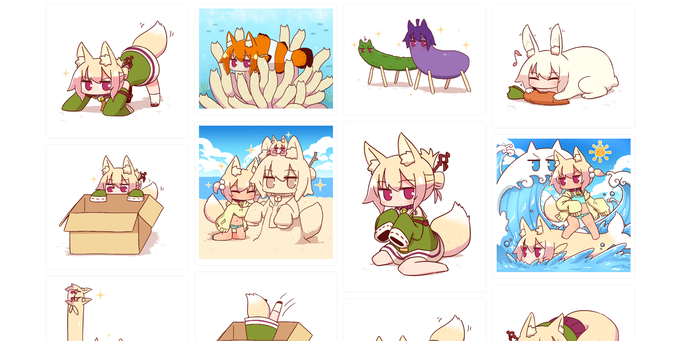

# client
 
Vite + vue3 实现上传图片页面，

1.上传功能：并发请求控制，显示请求进度,请求失败最大重试次数
2.瀑布流：瀑布流布局

## Recommended IDE Setup

[VSCode](https://code.visualstudio.com/) + [Volar](https://marketplace.visualstudio.com/items?itemName=Vue.volar) (and disable Vetur) + [TypeScript Vue Plugin (Volar)](https://marketplace.visualstudio.com/items?itemName=Vue.vscode-typescript-vue-plugin).

## Customize configuration

See [Vite Configuration Reference](https://vitejs.dev/config/).

## Project Setup

```sh
pnpm install
```

### Compile and Hot-Reload for Development

```sh
pnpm run dev
```
上传界面展示：

已上传图片瀑布流展示：
